# Kubernetes

## Kubernetes Architecture

- `Master Node` (control plane)

- `Worker Nodes` (each Node has a `kubelet` process running on it)

- `kubelet` is a primary "Node agent" is a process that makes it possible for the Cluster to talk to each other and execute tasks

- each `Worker Node` has containers of different applications deployed on it (a different number of docker containers run on these Worker Nodes)

- Worker Nodes is where the actual work is happening, where your applications are running

- Master Node runs several kubernetes processes that are absolutely neccessary to run and manage the Cluster properly, they are:

- `API Server` which is also a container, it is the ENTRY POINT to the Kubernetes Cluster, this is the process that the differenet kubernetes clients will talk to, like the UI (if using the dashboard), an API (if you are using some automated scripts/technology), and the CLI (command line tool)

- `Controller Manager` - which keeps an overview of the Cluster, whether something needs to be repaired or if a container died and it needs to be restarted etc.

- `Scheduler` which is responsible for scheduling containers on different Nodes based on the workload and available server resources on each Node. It is an intelligent process that decides on which Worker Node the next container should be scheduled on, based on the available resources on those Worker Nodes and the load that that container needs.

- Another key component of the Cluster is an `etcd` key:value storage, which holds at any time the state of the Kubernetes Cluster. It has all the configuration data and all the status data of each Node and each container inside of that Node. And the backing store is made up from this etcd snapshots, because you can recover that whole Cluster state using that etcd snapshot.

- the `Virtual Network` spans all of the Nodes that are part of the Cluster. It turns all of the Nodes inside of the Cluster into one powerful machine that has the sum of all the resources of each indivudal Node.

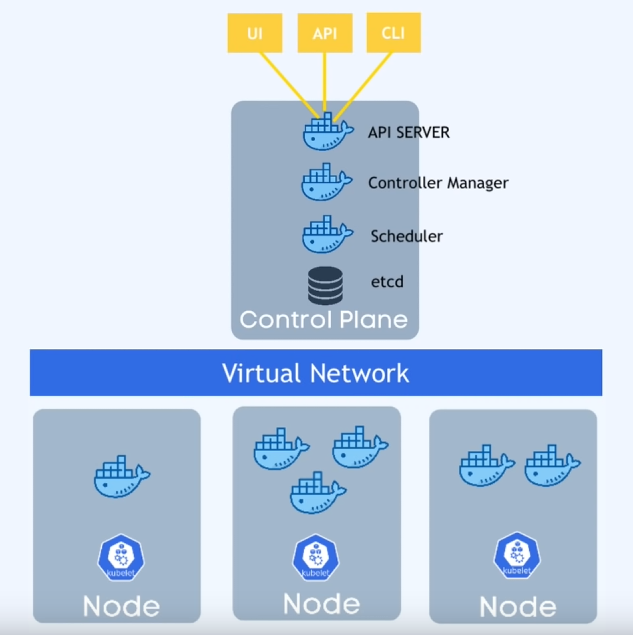

- The Master Nodes on the Control Plane only have a handlful of master processes, but are much more important, because if you lose a Master Node you can no longer access the Cluster anymore, so that means you have to have a backup of your Master Node, so in Production environments you would have at least 2 Masters inside your Kubernetes Cluster.

- the Worker Nodes have a much higher workload and require much bigger and more resources

## Main Kubernetes Components

- Components: `Pod`, `Service`, `Ingress`, `ConfigMap`, `Secret`, `Deployment`, `StatefulSet`, `DaemonSet`

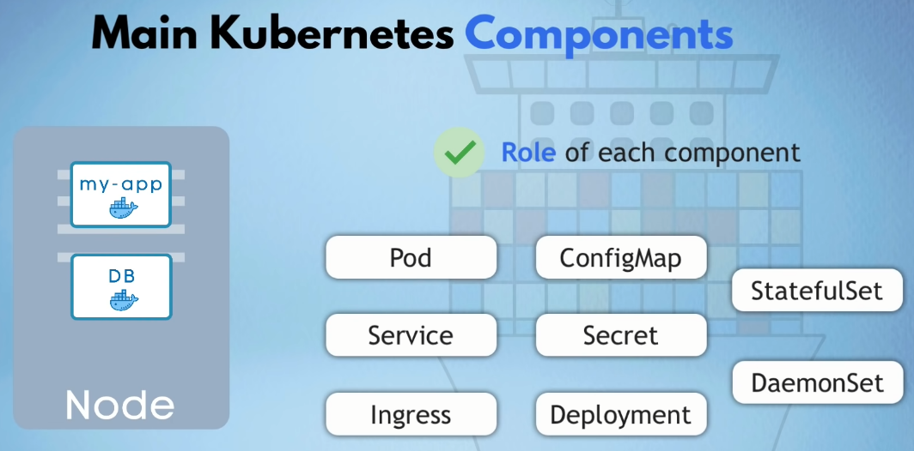

### Node and Pod

- A `Pod` is the smallest unit in Kubernetes (and is an abstraction over a Container)
- A Pod creates a (running environment) layer on top of the Container, Kubernetes wants to abstract away the specific container technologies (eg. Docker) so you can replace them if you want to
- A Pod usually has only one Application (or Container)
- Each Pod gets it's own IP Address (NOT the Container) and each Pod can communicate with each other using that IP Address
- Pods are Ephemeral, they can be lost very easily, and it will get replaced, but the new Pod that replaces it will get a new IP Address (which is inconvenient if you are communicating with the IP Address) and so another component of Kubernetes: Service is used.

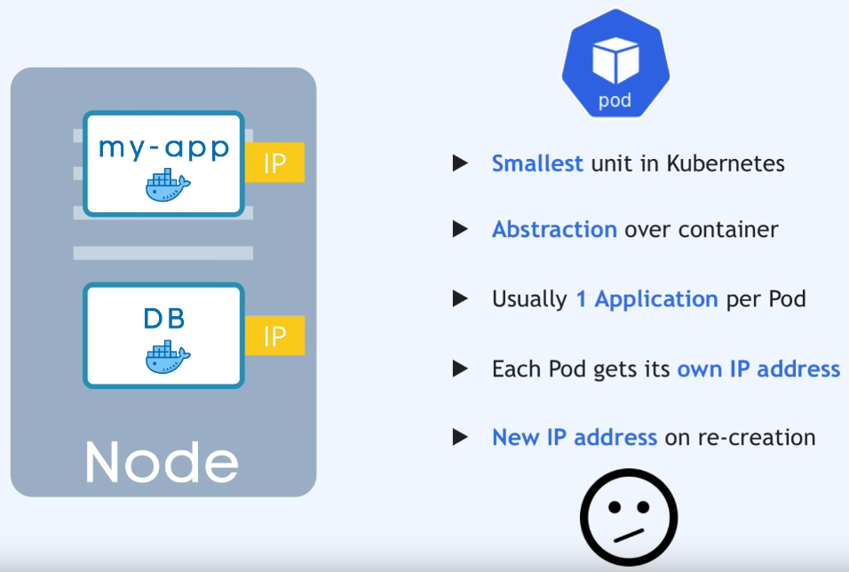

### Service and Ingress

- `Service` is a static IP Address that can be attached to each Pod.
- The Lifecycle of the Pod and Service are NOT connected, so even if the Pod dies the Service and it's IP Address will stay.
- We want our Application accessible through a Browser, and so we have to create an External Service (it opens communication from External Sources)
- But you don't want your Database accessible to Public Requests, so you can create an Internal Service (a type of service that you specify when creating one - Internal is the default)
- The Node can have an External Service with a port eg. http://123.456.789.100:8080/ but that is not great for Production, we would prefer to have a domain name etc. and for that we have another component Ingress.
- So instead of Service, the request first goes to Ingress, which does the forwarding to the Service.

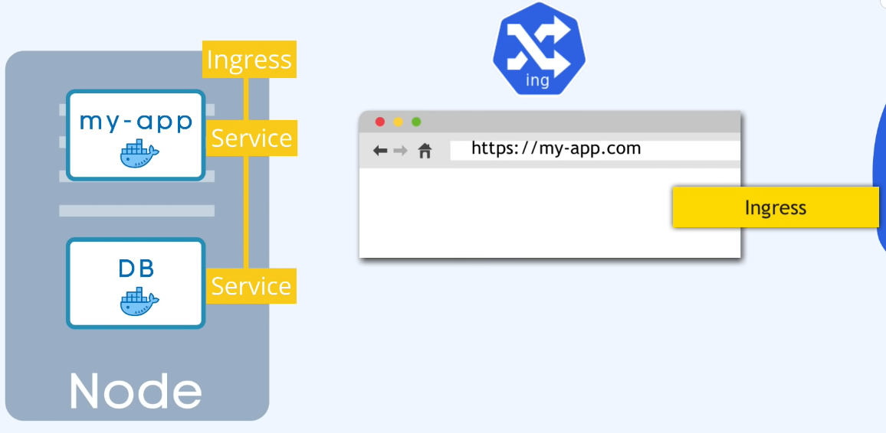

### ConfigMap and Secret

- Where do you usually configure the Endpoint or URL? You usually do it in the application or environment variable, but its usually inside the built image of the application. If the endpoint of the service or service name changed you would have to adjust that URL in the application, re-build the image, push it to dockerhub, pull it into your pod etc. This is a headache. Kubernetes has `ConfigMap` to solve this problem.

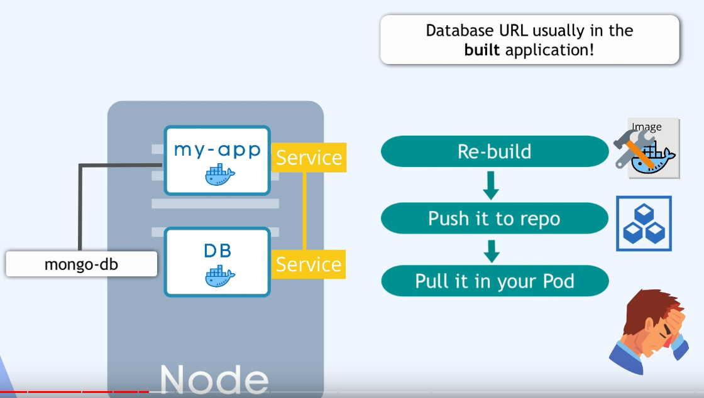

- It is your External Configuration of your application
- ConfigMap contains URL of a Database or other services that you use, and in Kubernetes you connect it to the Pod so that the Pod gets the data that ConfigMap contains. So you just adjust the ConfigMap, you don't have to build a new image.

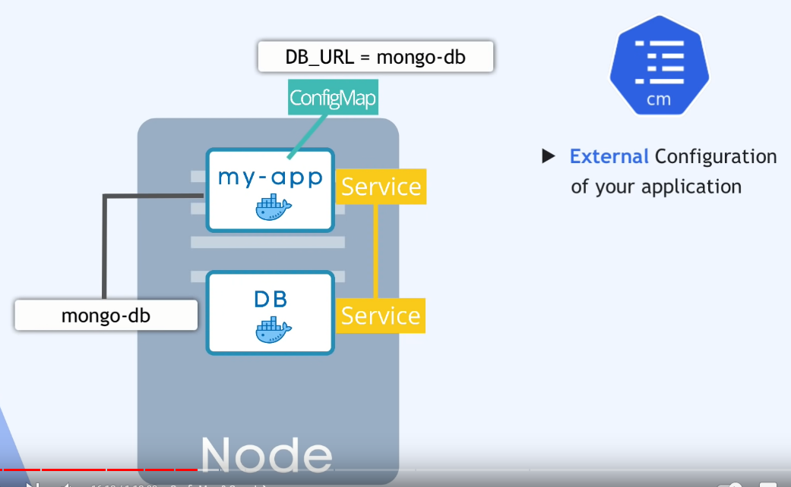

- Also we need a database user and password for example, but we should NOT put these in a ConfigMap it is insecure. For this purpose Kubernetes has `Secret`. Secret is just like ConfigMap but it is used to store Secret Data (credentials) but it is stored in base64encoded format, which is not encrypted by default, so it is meant to be encryptyed using third party tools in Kubernetes. And their are tool sfor this from cloud providers or third party tools to encrypt your Secrets.

- You reference Secret in the Pod, so the Pod can see that data and read the Secret, you can use the Data from ConfigMap or Secret inside of your application Pod using environment variables.

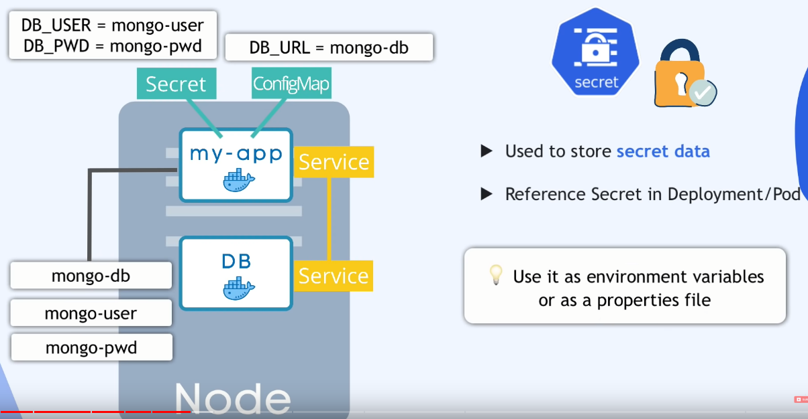

### Volume

- If we have a Database Pod(or Container) and it gets restarted the data would be gone. But we want our Data to be persistent. We can use `Volume` for this.
- It attaches a physical storage on a drive to your Pod and that storage could be on:
- A local machine (on the same server Node where the Pod is running)
- Or on a remote storage, outside of the Kubernetes Cluster (a cloud storage or your own premise storage)
- So when the Database Pod (or Container) gets restarted all the Data will there persisted.
- Kubernetes Cluster EXPLICLITLY does NOT manage any data persistence. You are responsible for backing up the data, replicating and managing it.

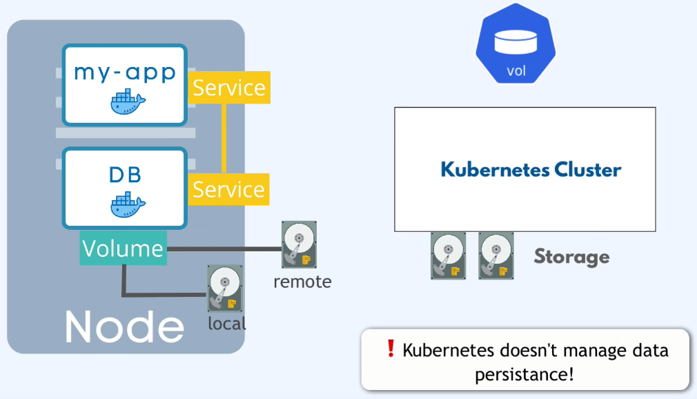

### Deployment and StatefulSet

- What happens if the application Pod dies, crashes or needs restarting to update the container image? You would have a downtime where a user can't reach your application.
- This is the advantage of "Distributed Systems" and containers.. so instead of relying on just one application Pod and one database Pod, we are replicating everything on multiple "Servers".
- So we would have a replica of our Node also running and IT IS CONNECTED TO THE SAME SERVICE
- Remember the Service is a persistent static IP address with a DNS Name so that you don't have to constantly adjust the endpoint when a Pod dies, the Service is also a Load Balancer, which means the Service will catch the Request and forward it to whichever Pod is less busy.
- In order to create the Replica of the original Pod, you wouldn't create a second Pod but instead define a Blueprint for the Pod and specify how many Replicas of that Pod you want to run. And that Blueprint is called `Deployment`.
- So in practice you are not working with Pods or creating Pods, you are working with Deployments.
- You can scale up or scale down the number of Pods that you need.
- Remember Pod is a layer of abstraction on top of containers, and so Deployment is another abstraction on top of Pods which makes it more convenient to interact with the Pods, replicate them, and do other configuration.

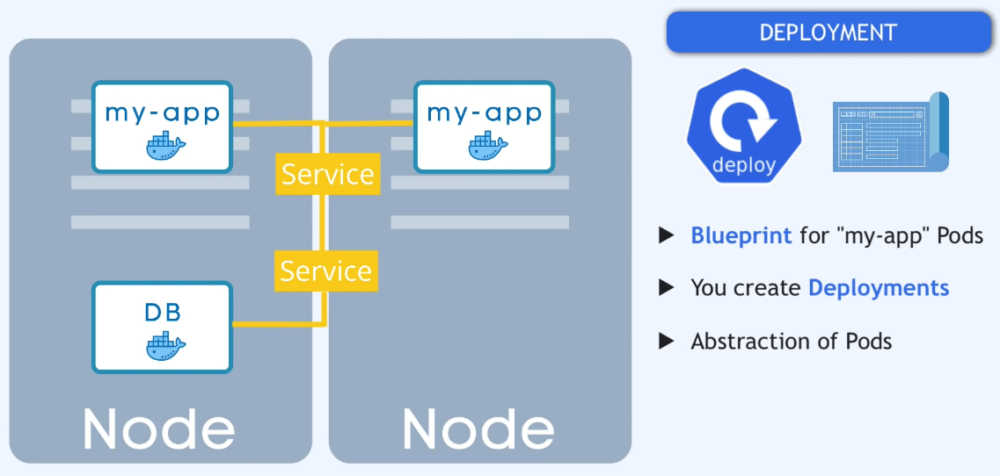

- So if one of the Replicas of your "application" Pod will die the Service will forward the Requests to another

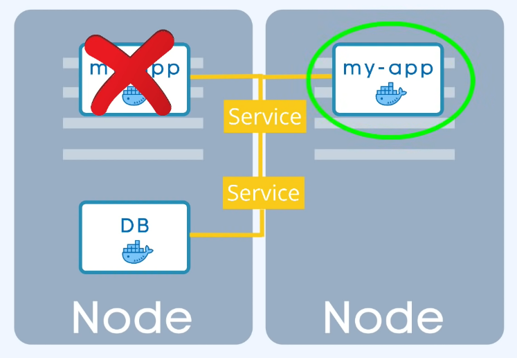

- What if the Database Pod died? Yoru application still wouldn't be accesible... So we need a Database Replica... BUT WE CAN'T REPLICATE a DATABASE using a Deployment. The reason for this is the Database has a STATE meaning its Data, if we have Replicas of a Database Pod they would all have to access the same shared Database Storage and there you would need a mechanism of which Pods are currently WRITING to that storage or which Pods are currently READING from that Storage in order to avoid Data inconsistencies. And that mechanism in addition to the replicating feature is offered by another Kubernetes component called `StatefulSet`. It is mean't specifically for Applications like Databases (Stateful Apps). StatefulSet takes care of Replicating the Pods and Scaling them up or down, but making sure the Databse reads or writes are Synchronised so that no Database inconsistencies are offered.

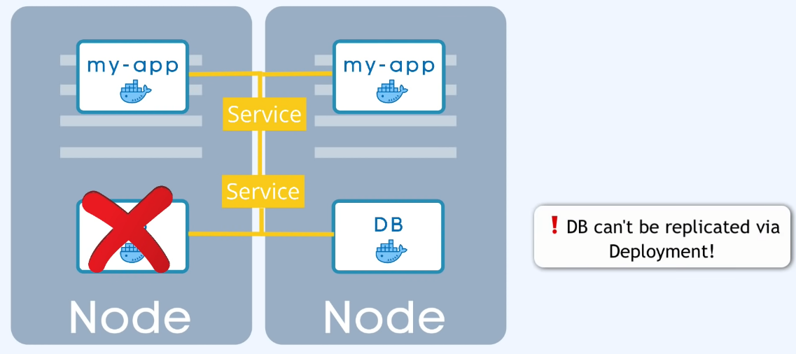
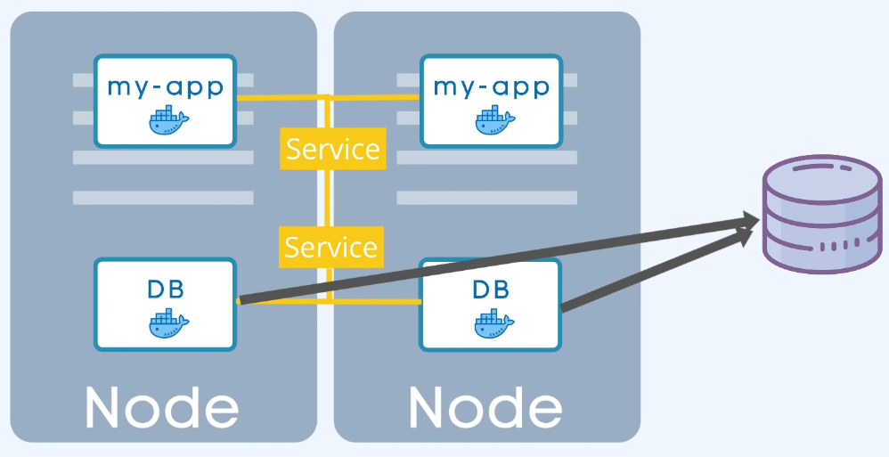
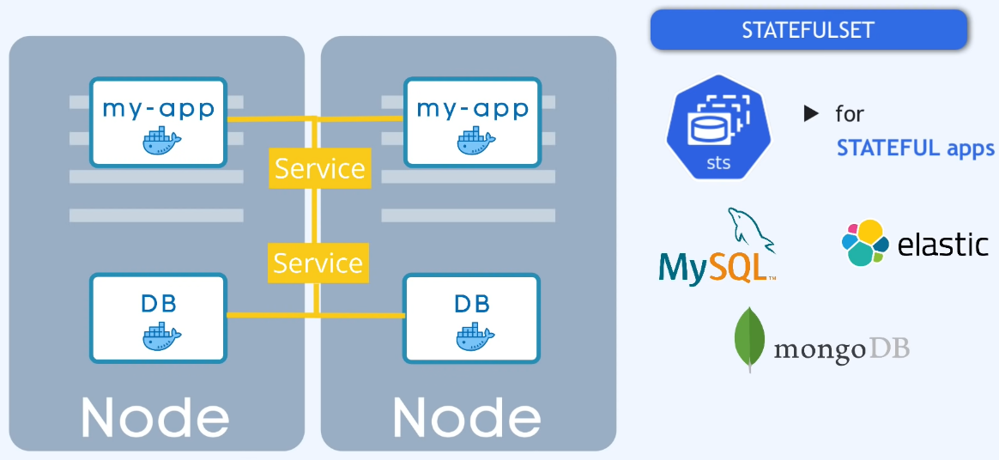
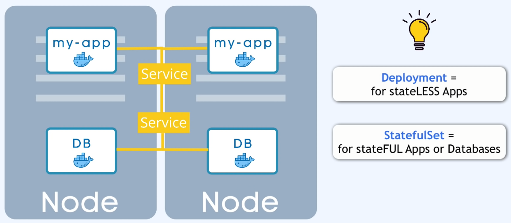

- WARNING: Deploying StatefulSet in a Kubernetes Cluster is not easy and can be tedious. So Databases are often hosted outside of the Kubernetes Cluster. And just have the Deployments that replicate and scale with no problem inside of the Kubernetes Cluster and communicate with the External Database.

- So now even if one Node crashes we still have another Node running until the other gets replicated. So we can avoid downtime.

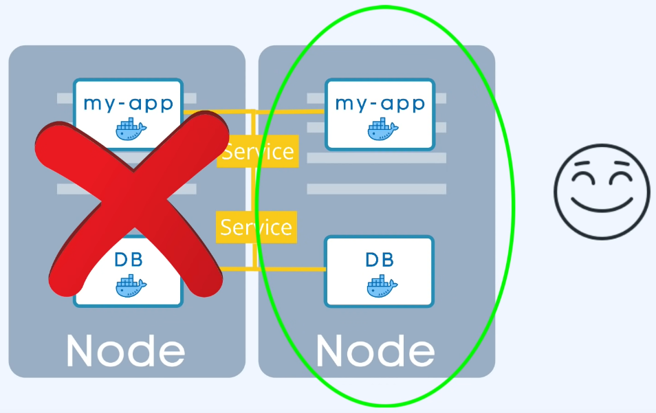

## Summary

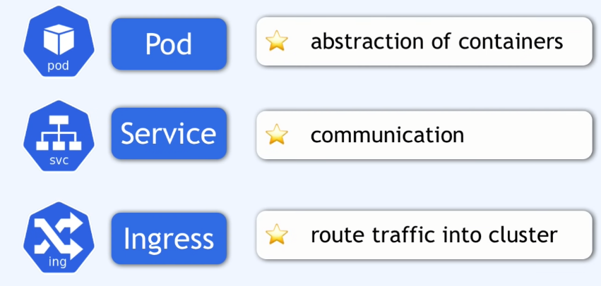
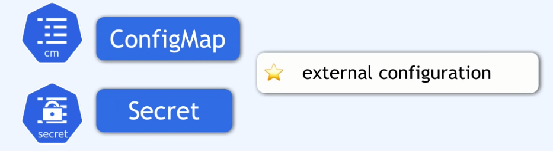

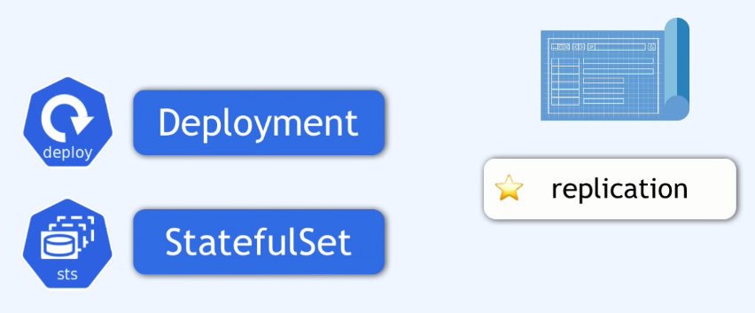
