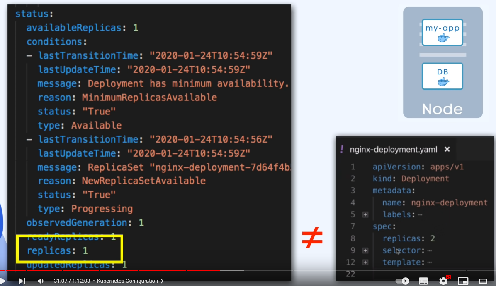
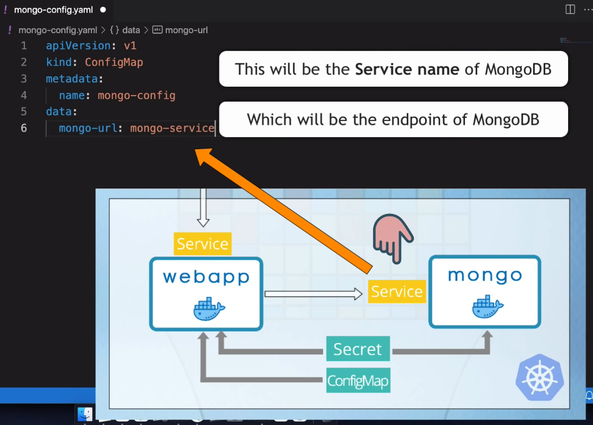
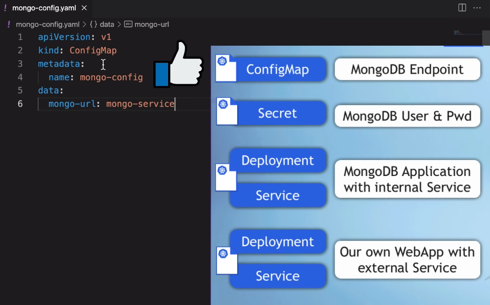

# Kubernetes

## Kubernetes Architecture

- `Master Node` (control plane)

- `Worker Nodes` (each Node has a `kubelet` process running on it)

- `kubelet` is a primary "Node agent" is a process that makes it possible for the Cluster to talk to each other and execute tasks

- each `Worker Node` has containers of different applications deployed on it (a different number of docker containers run on these Worker Nodes)

- Worker Nodes is where the actual work is happening, where your applications are running

- Master Node runs several kubernetes processes that are absolutely neccessary to run and manage the Cluster properly, they are:

- `API Server` which is also a container, it is the ENTRY POINT to the Kubernetes Cluster, this is the process that the differenet kubernetes clients will talk to, like the UI (if using the dashboard), an API (if you are using some automated scripts/technology), and the CLI (command line tool)

- `Controller Manager` - which keeps an overview of the Cluster, whether something needs to be repaired or if a container died and it needs to be restarted etc.

- `Scheduler` which is responsible for scheduling containers on different Nodes based on the workload and available server resources on each Node. It is an intelligent process that decides on which Worker Node the next container should be scheduled on, based on the available resources on those Worker Nodes and the load that that container needs.

- Another key component of the Cluster is an `etcd` key:value storage, which holds at any time the state of the Kubernetes Cluster. It has all the configuration data and all the status data of each Node and each container inside of that Node. And the backing store is made up from this etcd snapshots, because you can recover that whole Cluster state using that etcd snapshot.

- the `Virtual Network` spans all of the Nodes that are part of the Cluster. It turns all of the Nodes inside of the Cluster into one powerful machine that has the sum of all the resources of each indivudal Node.


- The Master Nodes on the Control Plane only have a handlful of master processes, but are much more important, because if you lose a Master Node you can no longer access the Cluster anymore, so that means you have to have a backup of your Master Node, so in Production environments you would have at least 2 Masters inside your Kubernetes Cluster.

- the Worker Nodes have a much higher workload and require much bigger and more resources

## Main Kubernetes Components

- Components: `Pod`, `Service`, `Ingress`, `ConfigMap`, `Secret`, `Deployment`, `StatefulSet`, `DaemonSet`


### Node and Pod

- A `Pod` is the smallest unit in Kubernetes (and is an abstraction over a Container)
- A Pod creates a (running environment) layer on top of the Container, Kubernetes wants to abstract away the specific container technologies (eg. Docker) so you can replace them if you want to
- A Pod usually has only one Application (or Container)
- Each Pod gets it's own IP Address (NOT the Container) and each Pod can communicate with each other using that IP Address
- Pods are Ephemeral, they can be lost very easily, and it will get replaced, but the new Pod that replaces it will get a new IP Address (which is inconvenient if you are communicating with the IP Address) and so another component of Kubernetes: Service is used.


### Service and Ingress

- `Service` is a static IP Address that can be attached to each Pod.
- The Lifecycle of the Pod and Service are NOT connected, so even if the Pod dies the Service and it's IP Address will stay.
- We want our Application accessible through a Browser, and so we have to create an External Service (it opens communication from External Sources)
- But you don't want your Database accessible to Public Requests, so you can create an Internal Service (a type of service that you specify when creating one - Internal is the default)
- The Node can have an External Service with a port eg. http://123.456.789.100:8080/ but that is not great for Production, we would prefer to have a domain name etc. and for that we have another component Ingress.
- So instead of Service, the request first goes to Ingress, which does the forwarding to the Service.


### ConfigMap and Secret

- Where do you usually configure the Endpoint or URL? You usually do it in the application or environment variable, but its usually inside the built image of the application. If the endpoint of the service or service name changed you would have to adjust that URL in the application, re-build the image, push it to dockerhub, pull it into your pod etc. This is a headache. Kubernetes has `ConfigMap` to solve this problem.


- It is your External Configuration of your application
- ConfigMap contains URL of a Database or other services that you use, and in Kubernetes you connect it to the Pod so that the Pod gets the data that ConfigMap contains. So you just adjust the ConfigMap, you don't have to build a new image.


- Also we need a database user and password for example, but we should NOT put these in a ConfigMap it is insecure. For this purpose Kubernetes has `Secret`. Secret is just like ConfigMap but it is used to store Secret Data (credentials) but it is stored in base64encoded format, which is not encrypted by default, so it is meant to be encryptyed using third party tools in Kubernetes. And their are tool sfor this from cloud providers or third party tools to encrypt your Secrets.

- You reference Secret in the Pod, so the Pod can see that data and read the Secret, you can use the Data from ConfigMap or Secret inside of your application Pod using environment variables.


### Volume

- If we have a Database Pod(or Container) and it gets restarted the data would be gone. But we want our Data to be persistent. We can use `Volume` for this.
- It attaches a physical storage on a drive to your Pod and that storage could be on:
- A local machine (on the same server Node where the Pod is running)
- Or on a remote storage, outside of the Kubernetes Cluster (a cloud storage or your own premise storage)
- So when the Database Pod (or Container) gets restarted all the Data will there persisted.
- Kubernetes Cluster EXPLICLITLY does NOT manage any data persistence. You are responsible for backing up the data, replicating and managing it.


### Deployment and StatefulSet

- What happens if the application Pod dies, crashes or needs restarting to update the container image? You would have a downtime where a user can't reach your application.
- This is the advantage of "Distributed Systems" and containers.. so instead of relying on just one application Pod and one database Pod, we are replicating everything on multiple "Servers".
- So we would have a replica of our Node also running and IT IS CONNECTED TO THE SAME SERVICE
- Remember the Service is a persistent static IP address with a DNS Name so that you don't have to constantly adjust the endpoint when a Pod dies, the Service is also a Load Balancer, which means the Service will catch the Request and forward it to whichever Pod is less busy.
- In order to create the Replica of the original Pod, you wouldn't create a second Pod but instead define a Blueprint for the Pod and specify how many Replicas of that Pod you want to run. And that Blueprint is called `Deployment`.
- So in practice you are not working with Pods or creating Pods, you are working with Deployments.
- You can scale up or scale down the number of Pods that you need.
- Remember Pod is a layer of abstraction on top of containers, and so Deployment is another abstraction on top of Pods which makes it more convenient to interact with the Pods, replicate them, and do other configuration.


- So if one of the Replicas of your "application" Pod will die the Service will forward the Requests to another


- What if the Database Pod died? Yoru application still wouldn't be accesible... So we need a Database Replica... BUT WE CAN'T REPLICATE a DATABASE using a Deployment. The reason for this is the Database has a STATE meaning its Data, if we have Replicas of a Database Pod they would all have to access the same shared Database Storage and there you would need a mechanism of which Pods are currently WRITING to that storage or which Pods are currently READING from that Storage in order to avoid Data inconsistencies. And that mechanism in addition to the replicating feature is offered by another Kubernetes component called `StatefulSet`. It is mean't specifically for Applications like Databases (Stateful Apps). StatefulSet takes care of Replicating the Pods and Scaling them up or down, but making sure the Databse reads or writes are Synchronised so that no Database inconsistencies are offered.


- WARNING: Deploying StatefulSet in a Kubernetes Cluster is not easy and can be tedious. So Databases are often hosted outside of the Kubernetes Cluster. And just have the Deployments that replicate and scale with no problem inside of the Kubernetes Cluster and communicate with the External Database.

- So now even if one Node crashes we still have another Node running until the other gets replicated. So we can avoid downtime.


## Summary


## Kubernetes Configuration

- All the configuration goes in a Kubernetes Cluster goes through a Master Node (Control Planet) with a process called API Server
- The UI, or API, or CLI all send their Configuration Requests to the API Server which is the only entry point into the Cluster, and the requests have to be in YAML or JSON format.

```yaml
apiVersion: apps/v1
kind: Deployment
metadata:
  name: my-app
  labels:
    app: my-app
spec:
  replicas: 2
  selector:
    matchLabels:
      app: my-app
  template:
    metadata:
      labels:
        app: my-app
  spec:
    containers:
      - name: my-app
        image: my-image
        env:
          - name: SOME_ENV
            value: $SOME_ENV
        ports:
          - containerPort: 8080
```

- With this we are sending a request to configure a component called Deployment which is basically a template/blueprint for creating Pods.
  ```yaml
  kind: Deployment
  ```
- In this specific example we tell Kubernetes to create 2 replica Pods

  ```yaml
  replicas: 2
  selector:
    matchLabels:
      app: my-app
  ```

- With each Pod replica having a container based on `my-image` running inside

  ```yaml
  containers:
    - name: my-app
      image: my-image
  ```

- In addition to that we configure what the Environment Variables and Port Number inside the Container inside of the Pod

  ```yaml
  env:
    - name: SOME_ENV
      value: $SOME_ENV
  ports:
    - containerPort: 8080
  ```

- The Configuration Requests in Kubernets are DECLARATIVE, we declare what is our desired outcome from Kubernetes and Kubernetes tries to meet those Requirements.

- For example, since we have declared that we wanted 2 Replica Pods of my-app Deployment to be run in the Cluster and one of those Pods dies, the Controller Manager sees that this Desired State and Actual State are now different. The Desired State is 2 and the Actual State is 1. It goes to work to make sure that this Desired State is recovered, automatically restarting the 2nd Replica of that Pod.


### 3 Parts of a Kubernetes Configuration File

`nginx-deployment.yaml` :

```yaml
apiVersion: apps/v1
kind: Deployment
metadata:
  name: nginx-deployment
  labels: ...
spec:
  replicas: 2
  selector: ...
  template: ...
```

`nginx-service.yaml`

```yaml
apiVersion: v1
kind: Service
metadata:
  name: nginx-service
spec:
  selector: ...
  ports: ...
```

- Every Configuration File has 3 Parts :

1. `metadata`:

   - `metadata` the metadata

   - the `name` of the component, and more...

     

2. `spec`ification:

   - `apiVersion` - each component has a different apiVersion (look them up)

   - `kind` is what kind of Component is this? eg. `Deployment` or `Service`

   - `spec` the specification of the component

   - attributes of `spec` are SPECIFIC to the `kind` of component you are creating. Deploymen has its own spec attributes and Service has its own spec attributes etc.

     

3. `status`:

   - it is automatically generated and added by Kubernetes

   - it uses this to compare the Desired State (in the specification) to the Actual State and is the basis of the Self-Healing aspect of Kubernetes

     

   - Where does that `status` data come from? It comes from the `etcd` in the Master Node (Control Plane)

   - The Cluster Brain one of the Master Processes that stores the Cluster Data

   - The `etcd` holds the current status of ANY Kubernetes Component

     

### Format of a Kubernetes Configuration File

- `yaml` is a human friendly data serialization standard for all programming languages

- but it is very strict about `indentation`!

- you should store the configuration files with your application code, or it can have its own git repository for it's configuration files

## `minikube`

- Usually in a Kubernetes world when you are setting up a production cluster it will look like this:

- You will have Multiple Masters (at least two)

- You will have Multiple Worker Nodes

- Master Nodes and Worker Nodes have their own separate responsibility

- You would have separate virtual or physical machines that each represent a Node
  

- If you want to test something on your local environment or want to try something out, deploying a new application or new components.. obviously setting up a Cluster like this will be difficult if you don't have enough resources.

- For this there is an open source tool called `minikube`

- `minikube` is one Node Cluster where the Master Processes and Worker Processes both run on one Node.

- And the Node will have a `Docker container runtime pre-installed`, so you will be able to run the Pods with Containers on this Node.

  

## `kubectl`

- Now you have a virtual Node on your local machine that represents `minikube` you need some way to interact with the Cluster, you need a way to create Kubernetes Components on that node.

- We do this using `kubectl` which is a Command Line Tool for Kubernetes Clusters

- Remember `minikube` runs both Master and Worker processes in a single Node, one of the master processes API Server is the main entry point into the Kubernetes Cluster, if you want to configure anything or create any component you first have to talk to the API Server with different clients, like UI/Dashboard, API, or CLI which is `kubectl`

- `kubectl` is the most powerful of the 3 clients^ you can do anything in Kubernetes that you want

- Once the `kubectl` submits commands to the API Server. The Worker Processes on `minikube` Node will actually make it happen. The Worker Processes enable Pods to run on Node. To create Pods, create Services, destroy Pods etc.


- `kubectl` is not just for `minikube` Cluster, if you have a Cloud Cluster or a Hybrid Cluster, `kubectl` is the tool to interact with ANY type of Kubernetes setup


## Install & Run `minikube`

- `minikube` can run either as a Container or a Virtual Machine, so we need either a Container Runtime or a Virtual Machine installed on our system.


- And this will be the driver for `minikube`. https://minikube.sigs.k8s.io/docs/drivers/ is a list of all the supported drivers and Docker is the preferred driver.

- This maybe confusing because inside the Kubernetes Cluster Pods we run Docker Containers.
  - `minikube` installation comes with Docker pre-installed to run the containers in the cluster.
  - But Docker as the driver for `minikube` means we are hosting `minikube` as a container on our local machine.


- So we need Docker installed on our machine before we can use `minikube`

- To install `minikube`:
  `curl -LO https://storage.googleapis.com/minikube/releases/latest/minikube-linux-amd64`
  `sudo install minikube-linux-amd64 /usr/local/bin/minikube`

- To start it: `minikube start`, we can specify a driver eg. `minikube start --driver docker`

- We can now interact with our Cluster using `kubectl`

- Display all the Nodes in the Cluster: `kubectl get node`

  ```
  NAME       STATUS   ROLES           AGE     VERSION
  minikube   Ready    control-plane   2m27s   v1.27.4
  ```

- So we have a Kubernetes Cluster running locally on our machine, and we can start deploying applications in it.

- We interact with the `minikube` cluster using `kubectl` Command Line Tool

- `minikube` is for the startup and deleting the Cluster, but everything else we do through `kubectl`

# Demo Project


## MongoDB Endpoint -> ConfigMap

- Documentation for `ConfigMap` https://kubernetes.io/docs/concepts/configuration/configmap/

- `mongo-config.yaml` (ConfigMap) will hold the Mongo URL

```yaml
apiVersion: v1
kind: ConfigMap # ConfigMap (keyword)
metadata:
  name: mongo-config # an arbitary name
data: # the actual contents - key-value pairs that we define as external configuration
  mongo-url: mongo-service # the value will be the Service that we will create for the Mongo Application
```






## MongoDB User & Password -> Secret

- Documentation for `Secret` https://kubernetes.io/docs/concepts/configuration/secret/

- `mongo-secret.yaml` (Secret) will hold the Mongo User and Pass

```yaml
apiVersion: v1
kind: Secret # Secret keyword
metadata:
  name: mongo-secret # an arbitrary name
type: Opaque # the generic type for defining Secret data key-value pairs
data: # the actual contents, the key-value pairs
  # the values in Secret are base64 encoded
  mongo-user: bW9uZ291c2Vy # mongouser encoded in base64
  mongo-password: bW9uZ29wYXNzd29yZA== # mongopassword encoded in base64
```


- Now when we create Deployments we can reference any of the values defined in our ConfigMap or Secret


## MongoDB Application with Internal Service

- Create a configuration file for Deployment & Service (you can have separate files for them, but it is a common thing to put them together because all the Deployments need Services)

### Deployment

- Documentation for `Deployment` https://kubernetes.io/docs/concepts/workloads/controllers/deployment/

- Mongo `Deployment` in `mongo.yaml` :

```yaml
apiVersion: apps/v1
kind: Deployment # Deployment keyword
metadata:
  name: mongo-deployment # an arbitrary name
  labels: # this is not mandatory in Deployment but good to have
    app: mongo
spec:
  replicas: 1 # this defines how many Pods you want to create
  selector: # this matches the Label to associate the Pod to the Deployment
    matchLabels:
      app: mongo # a key-value pair to use for matching
  template:
    metadata:
      labels:
        app: mongo # the label we give the Mongo App containers
    spec:
      containers:
        - name: mongodb
          image: mongo:latest # create Pods with the image mongo:latest
          ports:
            - containerPort: 27017 # this port is exposed and listening for incoming connections
```

- `Deployment` has `metadata` and `spec`

- Inside of `Deployment` `spec` is `template` which is the configuration of the Pod within the configuration of `Deployment`. Notice it has its own `metadata` and own `spec`. So `template` configures the Pod.

- Inside of the `template` `spec` we have the definition of `containers`. This is a list of containers, you can have multiple containers in a Pod, but mostly one main application per Pod. Here we define which `image` and which `port`

- Search on DockerHub for the Mongo Image https://hub.docker.com/_/mongo/ then select `Tags` to see available Images and choose an Image eg. `mongo:latest`

- Under `Overview` : The MongoDB server in the image listens on the standard MongoDB port, `27017`, so connecting via Docker networks will be the same as connecting to a remote mongod.


- We have `labels` under `metadata`

- In Kubernetes you can give any Component a Label (it is a key-value pair). So you can label anything from Pod to Deployment etc. `labels` are additional identifiers of the Components in addition to the `name`. So you can identify and address specific Components using their `labels`.


- Why do we need `labels`? When we have multiple replicas of the same Pod, each Pod will get a Unique Name `mongo-101`, `mongo-111`, `mongo-210` however they can share the same label eg. `app:mongo` and that's why in the `metadata` of the Pod we always have `labels` so for Pods `labels` is a required field.

- For other Components like `Deployment` `labels` is optional but it is a good practice to set them.


- In the `Deployment` `spec` we have `selector` and under that `matchLabels`

- When we create Pod replicas, how does Kubernetes know which Pods belong to which `Deployment`?

- That is defined using `selector` and `matchLabels`

- `selector` is in the `spec` of the `Deployment` and this defines that all the Pods that match the `labels` eg. `app:mongo` belong to this `Deployment`.

- The key-value pair can be anything `mykey:myvalue`, but it is common practice to use `app:value` when labelling your Applications.

- The `Deployment` then can understand which Pods belong to it by matching those `labels`

- `replicas` defines how many Pods we want to create using this Blueprint


### Service

- Documentation for `Servoce` https://kubernetes.io/docs/concepts/services-networking/service/

- Mongo `Service` in `mongo.yaml` :

```yaml
apiVersion: v1
kind: Service
metadata:
  # this Service name is the name we reference in our ConfigMap as the Mongo End Point
  name: mongo-service # an arbitrary name
spec:
  selector: # the Service needs to know which Pods to forward the requests to
    app: mongo # so this should match the label of the Pods
  ports:
    - protocol: TCP
      # Service is accessible in the Cluster using its own IP Address and the Port
      # It can be any port but it is common practice to keep it the same as the targetPort to keep things simple.
      port: 27017
      # The Port of the Pods that belong to the Service that the Service should Forward the Request to
      # So the targetPort should ALWAYS be the same as the containerPort because that is the Port in the Containers where the Application is accessible
      targetPort: 27017
```

- we give it a `name` `mongo-service` which is referenced in the `ConfigMap` created earlier. This is the Mongo End Point.

- Under `spec` we have `selector` because the Service needs to know which Pods to forward the Requests to, so it uses the `label` selector.


- The Service is accessible in the Cluster using its own IP Address and the `port` we define. It can be any port but it is common practice to keep it the same as the `targetPort` to keep things simple.

- the `targetPort` is the port of the Pods that belong to the Service, that the Service should Forward the Request to. So the `targetPort` should ALWAYS be the same as the `containerPort` in `Deployment` because that is the port in the Containers where the Application is accessible.


## Our own WebApp with External Service -> Deployment & Service

- We can just copy most of the above and make adjustments.

- The image is a simple NodeJS API

- WebApp `Deplomyment` in `webapp.yaml` :

```yaml
apiVersion: apps/v1
kind: Deployment # Deployment keyword
metadata:
  name: webapp-deployment # an arbitrary name
  labels: # this is not mandatory in Deployment but good to have
    app: webapp
spec:
  replicas: 1 # this defines how many Pods you want to create
  selector: # this matches the Label to associate the Pod to the Deployment
    matchLabels:
      app: webapp # a key-value pair to use for matching
  template:
    metadata:
      labels:
        app: webapp # the label we give the Mongo App containers
    spec:
      containers:
        - name: webapp
          image: nanajanashia/k8s-demo-app:v1.0 # create Pods with the image mongo:latest
          ports:
            - containerPort: 3000 # this port is exposed and listening for incoming connections
```

- WebApp `Service` in `webapp.yaml` :

```yaml
apiVersion: v1
kind: Service
metadata:
  # this Service name is the name we reference in our ConfigMap as the Mongo End Point
  name: webapp-service # an arbitrary name
spec:
  selector: # the Service needs to know which Pods to forward the requests to
    app: webapp # so this should match the label of the Pods
  ports:
    - protocol: TCP
      # Service is accessible in the Cluster using its own IP Address and the Port
      # It can be any port but it is common practice to keep it the same as the targetPort to keep things simple.
      port: 3000
      # The Port of the Pods that belong to the Service that the Service should Forward the Request to
      # So the targetPort should ALWAYS be the same as the containerPort because that is the Port in the Containers where the Application is accessible
      targetPort: 3000
```


## Pass Secret data to Mongo Deployment

- We need to set the MongoDB User and Password on Startup, and in the Mongo Image documentation on DockerHub we can see the Envrionment Variable Names:

```yaml
environment:
  MONGO_INITDB_ROOT_USERNAME: root
  MONGO_INITDB_ROOT_PASSWORD: example
```

- And these are usually required fields in most of the Database Images, so we must set them.

- So how do we pass these Environment Variables to the Mongo Application running inside a Container?

```yaml
spec:
  containers:
    - name: mongodb
      image: mongo:latest
      ports:
        - containerPort: 27017
      env: # here we use env, which is a list of Environment Variables
        - name: MONGO_INITDB_ROOT_USERNAME
          # value: myuser  # we could directly write them here but instead:
          valueFrom: # we use "valueFrom" to reference them from the Secrets configuration
            secretKeyRef: # using "secretKeyRef"
              name: mongo-secret # this is the name of the Secret configuration
              key: mongo-user # this is the key name
        - name: MONGO_INITDB_ROOT_PASSWORD
          valueFrom:
            secretKeyRef:
              name: mongo-secret
              key: mongo-password
```

- In the `Deployment` `spec` `template` `spec` `containers` we use the `env` keyword.

- Each environment variable must have a `name` and a `value`.

- We can directly hardcode the value. Or if we want to get it from a `ConfigMap` or `Secret` we use the `valueFrom` keyword.

- In the case of a Secret we use `secretKeyRef` and pass it the `metadata` `name` from the `Secret` component

- We then choose which `key` we want to use to access it's `value`.

- Now when the Container starts a User with those credentials will be created.


## Pass ConfigMap and Secret data to WebApp Deployment

- When our WebApp starts it will need to connect to the Database, so we need to give it information about the Database Endpoint, and which Username and Password to use to Authenticate with the Database.

- So again in the `Deployment` `spec` `template` `spec` `containers` we use the `env` keyword.

- In the case of a ConfigMap we use `configMapKeyRef` and pass it the `metadata` `name` from the `ConfigMap` component

- We then choose which `key` we want to use to access it's `value`

- Now when the Container starts it has everything it needs to connect to the Database


```yaml
spec:
  containers:
    - name: webapp
      image: nanajanashia/k8s-demo-app:v1.0
      ports:
        - containerPort: 3000
      env: # we pass the environment variables to the container
        - name: USER_NAME # this is defined in the Image^
          valueFrom:
            secretKeyRef:
              name: mongo-secret # this is the name of the Secret configuration
              key: mongo-user # this is the key name
        - name: USER_PWD # this is defined in the Image^
          valueFrom:
            secretKeyRef:
              name: mongo-secret # this is the name of the Secret configuration
              key: mongo-password # this is the key name
        - name: DB_URL # this is defined in the Image^
          valueFrom:
            configMapKeyRef: # this is how to reference a key in a ConfigMap
              name: mongo-config # this is the name of the Secret configuration
              key: mongo-url # this is the key name
```

- Using `ConfigMap` and `Secret` we can now pass these values to as many Containers as we need without reptition using KeyRef.


## Configure External Service on WebApp

- We now need to make the WebApp accessible from the outside. We want to be able to type in a URL and access our Web Application from the browser.


- We will need to adjust the WebApp `Service`, at the moment both `Services` are Internal (by default). We need to set a `type` which is by default `ClusterIP` (an Internal Service type). But if we set `type` to `NodePort` (an External Service type)

- NodePort requires a third Port called `nodePort`. This is a port that will open on the Kubernetes Nodes on which the application will be accessible `<NodeIP>:<NodePort>`. So we will be able to access this WebApp `Service` on this Port which will then be able to access the Pods behind it.

- NodePort range is defined in Kubernetes and must be between `3000` - `32767`. In this example we will use `30100`

```yaml
apiVersion: v1
kind: Service
metadata:
  name: webapp-service
spec:
  type: NodePort # this makes the Service an External Service type (the default being ClusterIP - Internal Service type)
  selector:
    app: webapp
  ports:
    - protocol: TCP
      port: 3000
      targetPort: 3000
      # nodePort is a port that will open a port into your Node <NodeIP>:<NodePort>
      nodePort: 30100
```


## Deploy all resources in Minikube Cluster

- We will now create these Components one by one

- `kubectl get pod` No resources found in default namespace.

- There are currently no Components

- First we need to make the `ConfigMap` and `Secret` because they need to be there when we create Mongo Database and WebApp `Deployment`s because they reference those.

- `apply` manages applications through files defining Kubernetes resources: `kubectl apply -f <filename.yaml>`

```sh
$ kubectl apply -f mongo-config.yaml
configmap/mongo-config created
```

```sh
$ kubectl apply -f mongo-secret.yaml
secret/mongo-secret created
```

- now we will create the Mongo Database because our WebApp depends on it, so it should start first

```sh
$ kubectl apply -f mongo.yaml
deployment.apps/mongo-deployment created
service/mongo-service created
```

- now we can create the WebApp

```sh
$ kubectl apply -f webapp.yaml
deployment.apps/webapp-deployment created
service/webapp-service created
```

## Interacting with the Kubernetes Cluster

- Let's now check all the Pods and Components that were created in the Cluster using `kubectl get all`

```sh
$ kubectl get all
NAME                                    READY   STATUS    RESTARTS   AGE
pod/mongo-deployment-766444cdf6-f8qnl   1/1     Running   0          2m34s
pod/webapp-deployment-f8d7df85d-f7sqs   1/1     Running   0          64s

NAME                     TYPE        CLUSTER-IP       EXTERNAL-IP   PORT(S)          AGE
service/kubernetes       ClusterIP   10.96.0.1        <none>        443/TCP          15h
service/mongo-service    ClusterIP   10.100.132.182   <none>        27017/TCP        3m53s
service/webapp-service   NodePort    10.110.188.108   <none>        3000:30100/TCP   64s

NAME                                READY   UP-TO-DATE   AVAILABLE   AGE
deployment.apps/mongo-deployment    1/1     1            1           2m34s
deployment.apps/webapp-deployment   1/1     1            1           64s

NAME                                          DESIRED   CURRENT   READY   AGE
replicaset.apps/mongo-deployment-766444cdf6   1         1         1       2m34s
replicaset.apps/webapp-deployment-f8d7df85d   1         1         1       64s
```

- We don't see `ConfigMap` or `Secret` here. We can get them with `kubectl get configmap` and `kubectl get secret`.

```sh
$ kubectl get configmap
NAME               DATA   AGE
kube-root-ca.crt   1      15h
mongo-config       1      7m37s
```

```sh
$ kubectl get secret
NAME           TYPE     DATA   AGE
mongo-secret   Opaque   2      6m27s
```

- `kubectl` is a very powerful tool, use the `--help` flag to see all the subcommands : `kubectl --help`

- And for each subcommand eg. `get` you can also use `--help` : `kubectl get --help`

- If you want to see more details you can use `kubectl describe` and then give it the type and name of a Component : `kubectl describe service webapp-service`

- If you want to check the logs of the Pods you can use `kubectl logs <podName>` : `kubectl logs webapp-deployment-f8d7df85d-f7sq` and you can stream the logs using `-f`

```sh
$ kubectl logs webapp-deployment-f8d7df85d-f7sqs
app listening on port 3000!
```

## Validate that the WebApp is accessible from the Browser

- We use `kubectl get svc`

```sh
$ kubectl get svc
NAME             TYPE        CLUSTER-IP       EXTERNAL-IP   PORT(S)          AGE
kubernetes       ClusterIP   10.96.0.1        <none>        443/TCP          15h
mongo-service    ClusterIP   10.100.132.182   <none>        27017/TCP        11m
webapp-service   NodePort    10.110.188.108   <none>        3000:30100/TCP   8m55s
```

- How do we access the Service from the Browser? Which IP Addres is it accessible at?

- The `NodePort` Service is always accessible at the IP Address of the Cluster Node, so all the Worker Nodes that the Cluster has.

- In this case we only have 1 Machine which is the `minikube`

- So we need the IP Address of the `minikube` to get that we use `minikube ip`

```sh
$ minikube ip
192.168.49.2
```

- Or using Kubernetes we can use `kubectl get node -o wide` -o denotes output and wide is a longer output, this gives yout he IP Address of the Node (INTERNAL-IP)

```sh
$ kubectl get node -o wide
NAME       STATUS   ROLES           AGE   VERSION   INTERNAL-IP    EXTERNAL-IP   OS-IMAGE             KERNEL-VERSION                      CONTAINER-RUNTIME
minikube   Ready    control-plane   15h   v1.27.4   192.168.49.2   <none>        Ubuntu 22.04.2 LTS   5.15.90.1-microsoft-standard-WSL2   docker://24.0.4
```

- So let's use this IP and the NodePort to check the WebApp in the Browser: http://192.168.49.2:30100/

- But I cannot seem to access it...

- The current proposed solution: `minikube service webapp-service`

  ```
  $ minikube service webapp-service
  |-----------|----------------|-------------|-------------------------|
  | NAMESPACE |      NAME      | TARGET PORT |           URL           |
  |-----------|----------------|-------------|-------------------------|
  | default   | webapp-service |        3000 | http://192.168.49.2:30100 |
  |-----------|----------------|-------------|-------------------------|
  🏃  Starting tunnel for service webapp-service.
  |-----------|----------------|-------------|------------------------|
  | NAMESPACE |      NAME      | TARGET PORT |          URL           |
  |-----------|----------------|-------------|------------------------|
  | default   | webapp-service |             | http://127.0.0.1:62077 |
  |-----------|----------------|-------------|------------------------|
  🎉  Opening service default/webapp-service in default browser...
  ```

- Why does this work ?

  - Using minikube service webapp-service is a convenient way to access your application running in a Minikube cluster when you are using a Docker driver on Windows, and there are a couple of reasons why this is necessary:

  - Networking and Routing in Minikube: Minikube creates a virtual machine (VM) to run a Kubernetes cluster on your local system. This VM has its own network configuration. When you deploy a service with a NodePort or LoadBalancer type in Kubernetes, the service is exposed on a specific port on the VM, not directly on your host machine (Windows in this case).

  - Windows and Docker: In your case, you are using the Docker driver for Minikube. When you run Minikube with the Docker driver on Windows, it effectively runs a Kubernetes cluster inside a Docker container within a VM. This additional level of abstraction can affect how network traffic is routed from your Windows host to the Kubernetes services.

  - Port Forwarding: The minikube service command sets up port forwarding to route traffic from your Windows host to the Minikube VM and then to your service. It provides a convenient way to access the service running inside the Minikube VM without having to deal with network configurations or firewall settings.

  - Network Isolation: Minikube aims to provide a consistent and isolated Kubernetes environment. It does this by creating a virtual network within the VM, and it doesn't automatically expose services to your Windows host's network. This isolation is beneficial for development and testing but requires port forwarding for external access.

  - Security: By default, Minikube runs in an isolated environment to avoid security risks and conflicts with other services on your Windows host. Port forwarding through minikube service allows you to control which services are accessible from your host machine.

  - So, the minikube service command with port forwarding is used to bridge the gap between your Windows host and the Kubernetes services running within the Minikube VM. It provides a seamless way to access your applications during development and testing without the need to manually configure network settings or expose ports.

  - It's important to note that this is specific to Minikube running with the Docker driver on Windows. In a production environment or with different Kubernetes distributions, the setup may vary, and services may be accessible without such port forwarding.

- We can also port forward using `kubectl port-forward service/webapp-service 80:3000`

```sh
$ kubectl port-forward service/webapp-service 80:3000
Forwarding from 127.0.0.1:80 -> 3000
Forwarding from [::1]:80 -> 3000
```

- And then visit http://localhost:80
